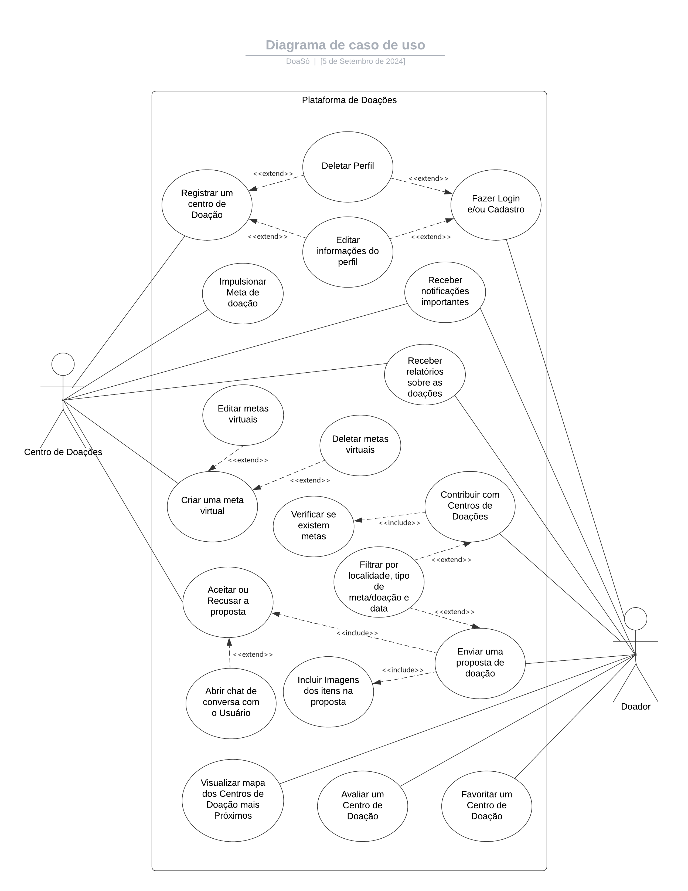

# Especificação do projeto

Durante a elaboração do projeto, trabalhamos em grupo para definir os problemas e o escopo do sistema, baseando-nos na observação e na pesquisa do público-alvo. Nosso objetivo era obter o máximo de informações possíveis para resolver as dores dos usuários. Para isso, realizamos entrevistas com o público-alvo e após analisar as informações coletadas, personificamos esse público, simulando seus padrões de rotina, a fim de entender como a DoaSô poderia melhorar suas vidas. Foram utilizadas as ferramentas do Trello para a criação das personas e as ferramentas do Lucidchart para a criação dos Casos de Uso. Seguem os dados coletados:

## Personas
Durante a fase de compreensão do problema, identificamos as seguintes personas:

| **Nome**         | **Imagem**                                                                                                  | **Idade** | **Profissão**              | **Frustrações**                          | **Hobbies**                 |
|------------------|-------------------------------------------------------------------------------------------------------------|:---------:|:--------------------------:|:----------------------------------------:|:---------------------------:|
| João Almeida     |      | 32 anos   | Analista de Suporte Técnico | Desconhecimento de onde doar Falta de tempo em sua rotina | Ciclismo Jogar Videogames |
| Fernanda Costa   |      | 25 anos   | Estudante de Biologia Estagiária de Laboratório | Falta de clareza sobre o que doar        | Fazer trilhas Cozinhar   |
| Pedro Nunes      |      | 45 anos   | Gerente de Projetos         | Falta de confiança nas instituições Acúmulo de objetos em casa | Filmes clássicos Fotografia |

Um pouco sobre as personas:

**João Almeida**

João tem 32 anos e trabalha como analista de suporte técnico. Ele é prático, focado em soluções rápidas e sempre buscando formas de simplificar sua rotina. No dia a dia, João se sente sobrecarregado com o acúmulo de objetos em casa, especialmente porque ele não gosta de perder tempo com processos complicados. Ele prefere resolver tudo rapidamente pelo celular ou notebook e sua maior frustração é não saber exatamente onde doar seus itens. O site de doações pode ajudá-lo oferecendo uma plataforma fácil de usar, que permita a ele doar com apenas alguns cliques e resolver esse problema de forma eficiente.

**Fernanda Costa**

Fernanda é uma jovem de 25 anos, estudante de biologia e estagiária em um laboratório ambiental. Muito preocupada com questões ecológicas e sociais, ela gosta de se envolver em causas que reflitam seus valores de sustentabilidade. Apesar de suas boas intenções, Fernanda muitas vezes se sente insegura sobre o impacto real de suas doações e quer garantir que suas ações realmente ajudem. Ela usa o celular e o tablet para seguir iniciativas ambientais, desta forma, o site de doações pode oferecer a ela uma maneira tangível de contribuir para essas causas. Mostrando o impacto das doações e garantindo um processo sustentável, o site pode conectar Fernanda às necessidades das instituições de forma transparente.

**Pedro Nunes**

Pedro, com 45 anos, é gerente de projetos em uma empresa de tecnologia. Ele é organizado, gosta de ter controle sobre o que faz, e valoriza a segurança em todos os processos. Pedro quer doar objetos que não usa mais, mas se sente desconfiado quanto à transparência das instituições e à logística de entrega. Ele é metódico, acessa o site principalmente pelo laptop ou tablet e busca soluções que tragam garantias claras. O site de doações pode proporcionar segurança e confiança ao fornecer informações detalhadas sobre o destino dos itens doados, assim como uma logística bem estruturada para facilitar o processo. Pedro ficará satisfeito com uma interface que ofereça transparência e acompanhamento das doações.

## Histórias de usuários
Com base na análise das personas, foram identificadas as seguintes histórias de usuários:

| **EU**            | **QUERO/PRECISO**                                        | **PARA**                                   |
|-------------------|----------------------------------------------------------|--------------------------------------------|
| João Almeida       | Visualizar locais de doação                              | Ter conhecimento de locais de entrega      |
| João Almeida       | Uma plataforma rápida e simples                          | Doar itens acumulados sem complicação      |
| João Almeida       | Receber notificações sobre novos locais de doação        | Saber de novas oportunidades sem buscar    |
| João Almeida       | Acessar um mapa interativo com locais próximos           | Escolher o local de doação mais conveniente|
| Fernanda Costa     | Saber o impacto das minhas doações                       | Garantir que estou ajudando de forma útil  |
| Fernanda Costa     | Uma lista de itens necessários                           | Doar algo que realmente seja útil          |
| Fernanda Costa     | Deixar comentários e avaliações dos locais de doação     | Compartilhar minha experiência com outros  |
| Pedro Nunes        | Saber da qualidade do local de doação                    | Doar com confiança e transparência         |
| Pedro Nunes        | Uma logística simplificada                              | Evitar complicações ao entregar doações    |
| Pedro Nunes        | Verificar a reputação e avaliações dos parceiros         | Garantir que a doação vai para instituição séria |
| Pedro Nunes        | Manter um registro de todas as doações feitas            | Acompanhar o histórico e entender rejeições|

## Requisitos

As tabelas a seguir apresentam os requisitos funcionais e não funcionais que detalham o escopo do projeto. A prioridade dos requisitos foi determinada no julgamento da equipe de desenvolvimento, levando em conta as principais funções da aplicação

### Requisitos funcionais

| **ID**  | **Descrição do Requisito**                                                                            | **Prioridade** |
|--------|-------------------------------------------------------------------------------------------------------|---------------|
| RF-001 | Permitir que novos parceiros se registrem e forneçam informações sobre seus locais de doação            | ALTA          |
| RF-002 | Facilitar o registro de voluntários que desejam contribuir com os parceiros e usuários da plataforma    | ALTA          |
| RF-003 | Exibir uma lista ou mapa de todos os locais disponíveis para doação, com informações detalhadas         | ALTA          |
| RF-004 | Permitir que os doadores deixem comentários e avaliem os locais de doação após utilizá-los              | MÉDIA         |
| RF-005 | Enviar notificações para parceiros e doadores sobre atividades relevantes                               | MÉDIA         |
| RF-006 | Oferecer uma barra de pesquisa e filtros avançados para ajudar os usuários a encontrar locais de doação  | ALTA          |
| RF-007 | Facilitar a edição e manutenção das informações dos perfis de usuários registrados na plataforma        | ALTA          |
| RF-008 | Permitir que os parceiros atualizem suas informações de perfil, como detalhes do local de doação        | ALTA          |
| RF-009 | Proporcionar um sistema de comunicação direta entre parceiros e doadores para discutir detalhes das doações | ALTA       |
| RF-010 | Utilizar geolocalização para mostrar aos usuários os locais de doação mais próximos                     | ALTA          |
| RF-011 | Permitir que os parceiros registrem os tipos específicos de doações que aceitam                         | ALTA          |
| RF-012 | Oferecer a opção de filtrar os locais de doação com base na proximidade em relação à localização atual   | MÉDIA         |
| RF-013 | Permitir que os usuários marquem locais de doação como favoritos para fácil acesso no futuro             | MÉDIA         |
| RF-014 | Manter um registro de doações que foram rejeitadas pelos parceiros, incluindo os motivos para tal        | MÉDIA         |
| RF-015 | Registrar todas as doações que foram aceitas pelos parceiros, facilitando o acompanhamento das atividades de doação do usuário | ALTA   |
| RF-016 | Permitir que os doadores deixem comentários sobre os parceiros, ajudando a manter a qualidade dos serviços | MÉDIA       |
| RF-017 | Fornecer uma funcionalidade para os doadores avaliarem os parceiros com base na experiência de doação    | MÉDIA         |
| RF-018 | Permitir que doadores enviem fotos das doações diretamente no chat com os parceiros                     | ALTA          |
| RF-019 | Permitir que o parceiro publique, edite e exclua suas metas virtuais                                    | ALTA          |
| RF-020 | Permitir que o usuário crie, edite e exclua seu perfil                                                 | ALTA          |
| RF-021 | O sistema deve emitir relatórios sobre as doações recebidas pelos parceiros e sobre doações feitas pelo usuário | BAIXA     |
| RF-022 | Permitir que o parceiro destaque/turbine sua meta por meio de pagamento                                 | ALTA          |
| RF-023 | Oferecer a opção de filtrar as metas baseado em localidade, tipo e data                                 | MÉDIA         |

### Requisitos não funcionais

| **ID**    | **Descrição do Requisito**                                                                                                 | **Prioridade** |
|-----------|----------------------------------------------------------------------------------------------------------------------------|----------------|
| RNF-001   | O site deve responder rapidamente às interações do usuário, com tempos de carregamento mínimos e processamento ágil         | ALTA           |
| RNF-002   | A interface do site deve ser intuitiva, fácil de entender e de navegar, permitindo que usuários de todos os níveis técnicos possam utilizá-lo sem dificuldades | ALTA   |
| RNF-003   | O site deve proteger as informações dos usuários e parceiros contra ameaças como acessos não autorizados, ataques cibernéticos e vazamentos de dados | ALTA |
| RNF-004   | O sistema deve estar disponível e funcional de forma consistente, com mínima ocorrência de falhas ou períodos de inatividade | ALTA          |
| RNF-005   | O design do site deve se adaptar a diferentes dispositivos e tamanhos de tela, proporcionando uma boa experiência de uso tanto em desktops quanto em dispositivos móveis | MÉDIA     |
| RNF-006   | O site deve funcionar corretamente em diferentes navegadores e sistemas operacionais, garantindo que todos os usuários tenham uma experiência consistente | MÉDIA  |
| RNF-007   | O código do site deve ser bem organizado, modular e documentado, facilitando a manutenção, correção de bugs e adição de novas funcionalidades | ALTA   |
| RNF-008   | O site deve garantir que os dados pessoais dos usuários sejam coletados, armazenados e processados de acordo com as regulamentações de privacidade aplicáveis | ALTA |

## Restrições

O projeto está restrito aos itens apresentados na tabela a seguir.

| **ID** | **Restrição**                                                                                             |
|--------|-----------------------------------------------------------------------------------------------------------|
| 01     | O projeto deve seguir os prazos de entrega estipulados para cada sprint.                                   |
| 02     | O projeto precisa ser intuitivo para todas as idades e níveis tecnológicos.                                |
| 03     | Todos os colaboradores do projeto precisam conhecer todas as etapas do projeto.                            |
| 04     | Todos os colaboradores do projeto precisam participar efetivamente de todas as etapas do projeto.          |
| 05     | O projeto precisa ser de fácil entendimento para todos os tipos de usuários.                               |
| 06     | O projeto deve cumprir com excelência todos os requisitos de cada sprint.                                  |
| 07     | As entregas intermediárias devem ser revisadas e validadas por todas as partes interessadas antes de avançar para a próxima fase. |
| 08     | As atualizações e revisões no escopo devem ser aprovadas por todos os desenvolvedores antes de serem implementadas. |
| 09     | A documentação do projeto deve ser atualizada e mantida em todas as fases de desenvolvimento.              |
| 10     | O código-fonte deve ser versionado adequadamente e estar disponível em repositórios acessíveis para a equipe. |
| 11     | O projeto deve atender a todas as métricas de qualidade acordadas, incluindo desempenho e segurança.       |

## Diagrama de casos de uso

A imagem  ilustra o diagrama de caso de uso da plataforma DoaSô, demonstrando as principais interações entre os usuários (Doadores e Centros de Doações) e o sistema. O diagrama evidencia funcionalidades cruciais, tais como o cadastro de usuários, envio de propostas de doação, bem como a aceitação ou recusa dessas propostas pelos centros de doação. Ademais, destaca-se a possibilidade de  visualização dos centros mais próximos através de um mapa interativo, e a comunicação direta entre doadores e centros por meio de chat, assegurando um processo de doação eficiente, transparente e acessível.

