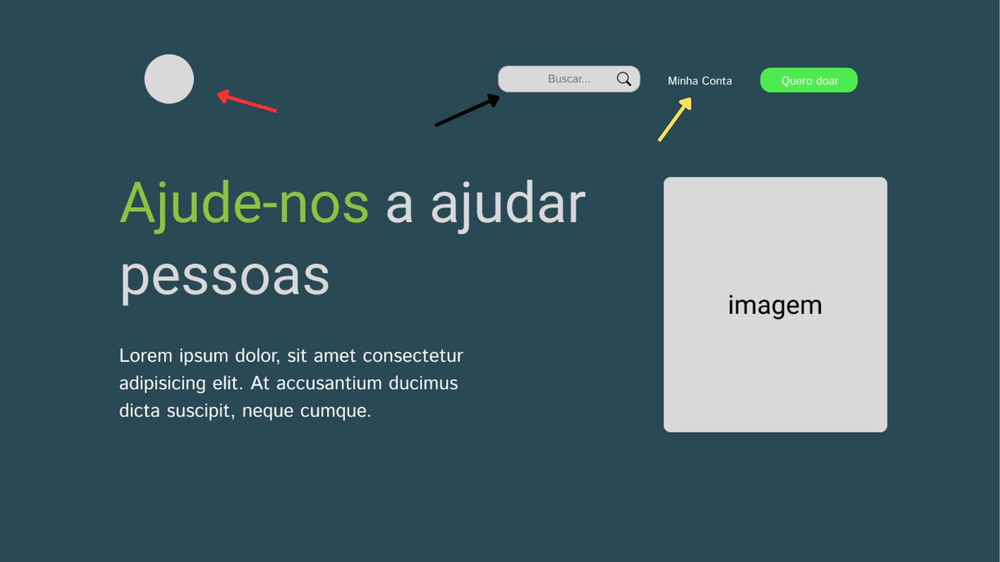
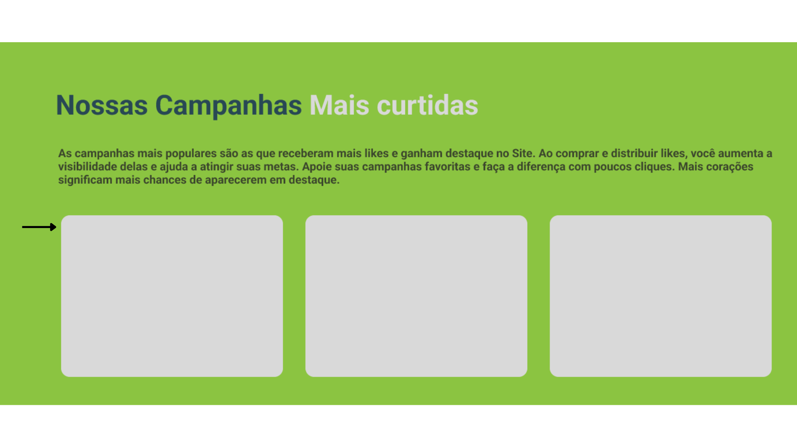
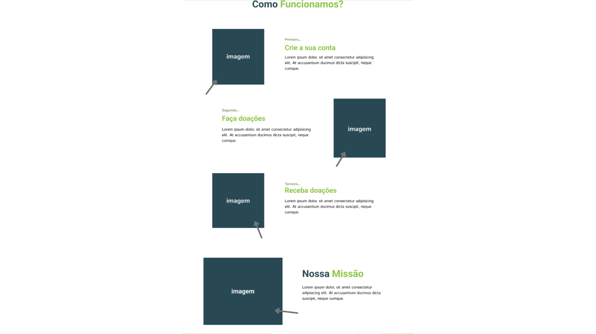

# Template padrão da aplicação

O site da DoaSô foi desenvolvido com o objetivo de proporcionar uma experiência visual agradável e envolvente para seus usuários. Com um design minimalista e elegante, a combinação de cores foi cuidadosamente escolhida para transmitir conforto, sofisticação e harmonia, criando um ambiente acolhedor e funcional.

## As principais cores utilizadas na interface foram:
- Um tom de ciano mais escuro, código `#284854`;
- Um tom de verde mais vibrante, código `#4FEB4F`;
- E um tom de cinza mais claro, código `#D9D9D9`.

## Exemplos de utilização nas páginas:

A página apresenta a cor de fundo de código `#284854`, com itens mais claros, proporcionando um destaque maior.

- A seta de cor vermelha indica o local onde se encontra o logotipo do site, sempre posicionado à esquerda das páginas;
- A seta de cor preta indica a barra de pesquisa, onde será possível buscar doações de acordo com palavras-chave;
- A seta de cor amarela indica o botão para acessar "Minha conta", onde será possível visualizar e editar os dados do perfil do usuário logado.

A página apresenta a cor de fundo de código `#4FEB4F`, chamando mais atenção para os itens citados.

- A seta de cor preta indica um carrossel de metas de doações, onde serão apresentadas 3 das mais curtidas no site, exibidas de forma rotativa.

A página apresenta a cor de fundo branca, proporcionando maior conforto visual para os usuários.

- Os itens indicados pelas setas cinzas mostram imagens cativantes sobre doações e sobre como utilizar o site da DoaSô, buscando ilustrar cada passo descrito pelos textos ao lado.
